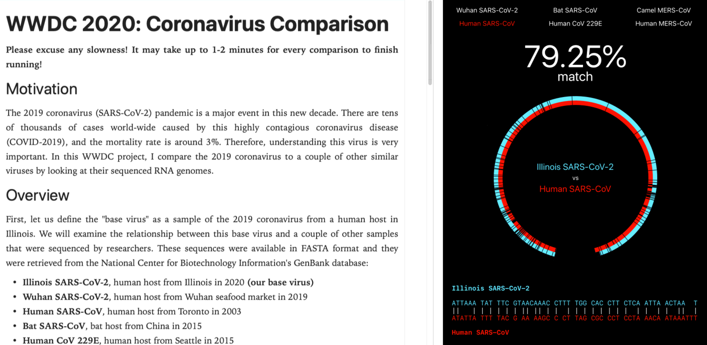

# WWDC 2020: Coronavirus Comparison
Efficiently comparing the 2019 coronavirus genome with a couple of other coronaviruses in Swift. This was created for the WWDC 2020 Swift Student Challenge.



**Youtube demo: [here](https://youtu.be/X12SKO0wGwg).**

## Setup
You can run this project by cloning this repository and opening the Xcode playground `WWDC2020.playground` in Xcode 11.3.

## Motivation

The 2019 coronavirus (SARS-CoV-2) pandemic is a major event in this new decade. There are millions of cases world-wide caused by this highly contagious coronavirus disease (COVID-2019). Therefore, understanding this virus is very important. In this WWDC project, I compare the 2019 coronavirus to a couple of other similar viruses by looking at their sequenced RNA genomes.

## Overview

First, let us define the "base virus" as a sample of the 2019 coronavirus from a human host in Illinois. This project allows us to visualize the relationship between this base virus and a couple of other samples that were sequenced by researchers. These sequences were available in FASTA format and they were retrieved from the National Center for Biotechnology Information's GenBank database:

* __Illinois SARS-CoV-2__, human host from Illinois in 2020 __(our base virus)__
* __Wuhan SARS-CoV-2__, human host from Wuhan seafood market in 2019
* __Human SARS-CoV__, human host from Toronto in 2003
* __Bat SARS-CoV__, bat host from China in 2015
* __Human CoV 229E__, human host from Seattle in 2015
* __Human MERS-CoV__, human host from Saudi Arabia in 2019
* __Camel MERS-CoV__, camel host from United Arab Emirates in 2014

The raw FASTA files are available in the `WWDC2020.playground/Resources/` directory.

## The Challenge

With coronavirus genomes reaching up to almost 30,000 nucleotides in length, aligning them will take a __significant__ amount of time. With the basic dynamic programming edit distance algorithm to find the similarities and differences between two genomes, this takes around __900 million__ operations and storing __900 million__ numbers in an array (repeated 6 times for comparing 6 different virus genomes!). This is __way too inefficient__ for a ~3 minute demo. Much of this project is dedicated to push Swift to the limit and calculate the alignments in real time.

## Algorithm

The edit distance or "Levenshtein distance" between two sequences is the number of gaps (sometimes called insertions or deletions) and mismatches between those two sequences. The actual edit operations (gaps and mismatches) make up the alignment of those two sequences. The basic Levenstein distance algorithm for calculating the edit distance value is a simple recursion, which can be expressed as

```
dp[i][j] = dp[i - 1][j - 1], if A[i - 1] == B[j - 1]
           max of {dp[i - 1][j - 1] + 1, dp[i][j - 1] + 1, dp[i - 1][j] + 1}, otherwise (A[i - 1] != B[j - 1])
```

for two strings `A` and `B` of length `n` and `m` using hand-wavy pseudocode. Special care must be taken for the first row/column. `dp[n][m]` is the Levenshtein distance between `A` and `B`. Of course, memoization can be used (as the name `dp` suggests, dynamic programming) to get a time complexity of `O(mn)`. This is not good enough for the ~30,000 nucleotide coronavirus genomes. Therefore, many interesting tricks for my implementation of this algorithm:

- Instead of dealing with raw strings, we can use a bit vector class (an array of `UInt`s, with some bit twiddling for getting and setting values) to try to pack nucleotides together and save space.

- Instead of building the full `n x m` dynamic programming matrix, we can use the last two rows for linear space complexity. Instead of creating a new row every time, we can cleverly overwrite portions of the second two last row as soon as they are not needed anymore for future computation.

- To figure out the exact sequence of mismatches and gaps to get the alignment, we can save the operation used to get to each dynamic programming matrix cell using the bit vector (only 4 operations total, so 2 bits). This requires saving the whole table, so the space complexity overall is technically still quadratic. However, the bit vector should save a lot of space. The backtrace part should take linear time after the Levenshtein distance is calculated.

- Although we are finding the distance between two strings, assume for now that we know the distance is bounded by some value `k`. Also, for simplicity the length of the two strings are the same. With these conditions, the algorithm only needs to calculate cells at most `k / 2` steps away from the main diagonal of the dynamic programming matrix. The intuition is that it takes `k / 2` steps to stray away from the main diagonal, and `k / 2` to come back before the ends of the strings are reached. Therefore, the time and space complexities can be lowered to `O(kn)` using this method. Let us call the portion of each row that is calculated a *window* that slides farther to the right after each row.

- In a paper, Ukkonen proved that the calculated Levenshtein distance in each diagonal (parallel to the main diagonal) is nondecreasing. Therefore, as soon as a diagonal reaches past `k` in the number of edits, we can just stop looking at cells later in the diagonal. With this knowledge, we can shrink the window that we examine from both sides as we examine each row in the dynamic programming matrix. The window can also be shrunk without diagonals reaching past `k`, since in the end, edits must be performed to get back to the main diagonal from another diagonal. Also, we can abort the calculation as soon as either boundary of the window crosses the main diagonal. This should lead to a good speedup.

- To figure out the value of `k` to use, we can use exponential search and keep doubling `k` until we can calculate the Levenshtein distance without stopping early because there were more than `k` edits. We upper bound `k` with the Hamming distance between the two strings, because the Levenshtein distance between those strings has to be less than or equal to the Hamming distance (intuition: more types of edits to use, so less edits needed). Worst case, we would spend twice as much time total (think sum of exponents) because the Levenshtein distance has to be calculated multiple times. But if `k` is small, this should lead to a good speedup.

- We can use multithreading to compute multiple edit distances/alignments in parallel. As soon as an alignment is computed, the UI is updated and it is able to be selected by the user. To stall for some time as these alignments are computed, a few slides that briefly describe the coronavirus are shown.

- For visualization, we can adopt the idea in `grep` and `diff` and only show portions of the virus genomes that have edits to save space.

## Limitations
For a serious analysis please use a well-established tool like BLAST. This project is merely a demostration of the algorithms and a visualization of the differences between coronavirus genomes.
